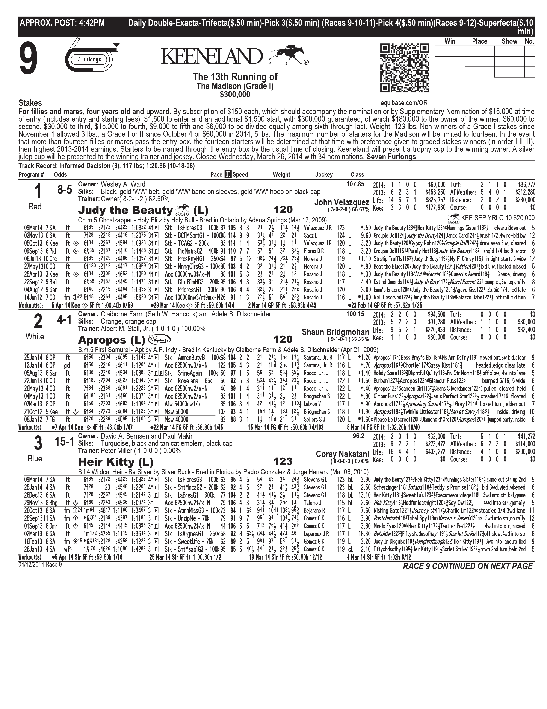

# Freebets

Freebets is a platform for generating real-time horse racing bets based on both purely technical strategies and machine-learning based predictive modeling. 

_Batteries (and some circuitry) not included._

## Live Demo

[Link](https://freebets.oakleypeavler.com)

This demo is currently running on randomly generated track and race data with no connection to real events. As a result, it is not useful for anything other than to demonstrate the platform (and maybe as a horse name generator).

## Inspiration

Ever been to a horse racing venue? If so, you are probably familiar with your provided lifeline, the race program:

This is a forgiving example - there are usually between 8-15 horses per race, and within the arcane symbols and abbreviations, you can find each horse's age, jockey, weight with and without the jockey, medication (and whether this is their first use of it), latest race, and workout, and split times at various past race stages... etc.

Unless you are a statistical savant or a professional [handicapper](https://en.wikipedia.org/wiki/Handicapping) that can afford committing potentially hours studying before race day at a single track, this usually means your best bet is to go by the book odds, or pick your favorite name/color/number (either of which is a sure way to lose).

Fortunately, computers can probably do better for the average person.

## Prior Art

There are some amazing success stories to be found down the rabbit hole of computer-aided horse betting, the ultimate example being [Bill Benter's](https://en.wikipedia.org/wiki/Bill_Benter) billion dollar lifetime winnings pioneering such a system to beat the public odds in the 80s.

Besides megayacht-winning systems, there have been many open-source examples, although these primarily target non-US race venues, where data is freely accessible (e.g. via the Betfair API), and within the limits of my searching, have not yielded a real-time system with UI.

There is also an abundance of whitepapers on technical horse betting strategies ranging from the early 70s to the present, most of which I have not been able to find applied in an automated system. See the [Works Referenced](#works-referenced) section for the current list of works referenced for this project.

## Purpose

Ultimately, I'd love for this to win me a spare billion dollars, but unfortunately it's turned out that creating an effective predictive model is not as easy as just feeding in a year's worth of racing data to a generic machine-learning algorithm. 

I do intend to pursue the process to an effective model in scope of at least a small range of tracks and their payout rules, but seeing as this may take hundreds more man-hours, as it did in Mr. Benter's case, it seemed like this would be a good piece in the meantime to showcase my work outside the corporate silos where the majority of that work lives.

That said, this can work effectively as-is in generating and evaluating bets internationally from a technical strategy and observing their profitability up to seconds before post time.

I also think that it may be valuable as:
- A living store for boilerplate code and design patterns that I usually have to look up/reinvent at every company transition
- An example of an enterprise-grade web stack and architecture using the latest "best practices" (to the best of my knowledge/ability) for the open-source community
- An "endless" project with a huge scope and depth that allows me to develop and test my skills in a way that's immediately measurable (in terms of how many races it wins), and potentially profitable

## What Isn't Included?

In compliance with copyright law, there are certain aspects of this project that cannot be redistributed:
- Any code related to fetching live racing data
- Any code related to fetching/parsing historical racing data

As a result, this platform will not be useful for live races without somewhat substantial additions. Interfaces have been provided that specify the methods and additional services needed; it is up to the user to implement them. See the `Batteries` section in the design docs for more details.

For demo purposes, a "demo" racing client that generates fake races has been implemented.

## Engineering / Design Docs

With the consumer-grade docs out of the way for now, the rest of my documentation effort will be focused on expanding the list below:

- [Initial Setup](./docs/init_setup.md)
- [Batteries](./docs/design/batteries.md)
- [Architecture](./docs/design/architecture.md)
- Data Structures/Schemas
- [Development Workflow](./docs/dev_workflow.md)

## Technologies Used
- Python/FastAPI REST API with test suite, SQLAlchemy ORM, and autogenerated OpenAPI docs
- PostgreSQL DB with Alembic for migrations
- Typescript, React & Redux/Saga frontend with test suite
- Pre-commit hooks for automatic linting, formatting, and testing
- Yandex Clickhouse as an ML datalake for historical races
- Yandex Catboost for predictions on race data via gradient-boosted trees
- Event-based (pub/sub) microservices architecture via RabbitMQ
- Docker and docker swarm build system for isolated dev/stage/prod environments and test DB
- Traefik load balancer/proxy

## WIPs

- Exotic/Complex Technical Bets & Strategies
- CLI
- ML Model Improvements

## Stretch Goals

- NLP Solver for original Dr. Z Formula

## Contributing

I don't expect any contributions at this point, but will be glad to review and accept them as they come with the time I have available.

## Works Referenced

Bolton, R. N. and R. G. Chapman. "Searching for positive returns at the track: a multinomial logit for handicapping horse races." (1986) Management Science 32, 1040–1–59  
Gramm, Marshall, and Douglas H. Owens. “Efficiency in Pari-Mutuel Betting Markets across Wagering Pools in the Simulcast Era.” Southern Economic Journal, vol. 72, no. 4, 2006, pp. 926–37. JSTOR, https://doi.org/10.2307/20111861. Accessed 14 Jul. 2022.  
Peter Cotton, "Inferring Relative Ability from Winning Probability in Multientrant Contests", SIAM Journal on Financial Mathematics 2021 12:1, 295-317  
Ziemba, William T., Hausch, Donald. Beat the Racetrack. Echo Point Books & Media, 2019.   
Ziemba, William T., "Parimutuel Betting Markets: Racetracks and Lotteries Revisited" (December 21, 2021). Available at SSRN: https://ssrn.com/abstract=3865785 or http://dx.doi.org/10.2139/ssrn.3865785  

