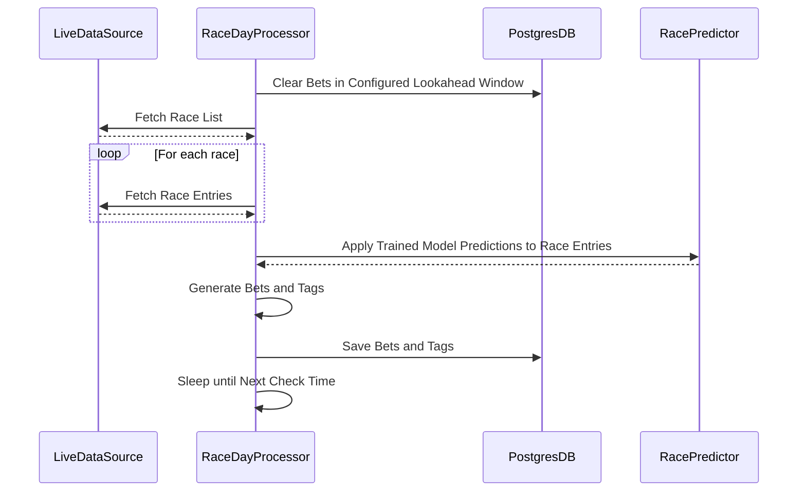
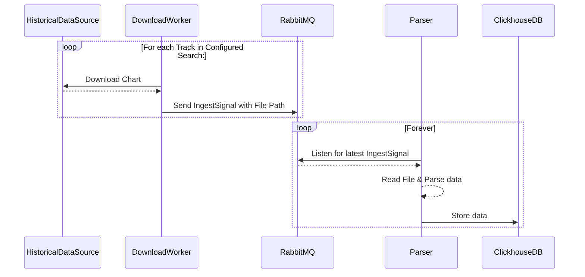
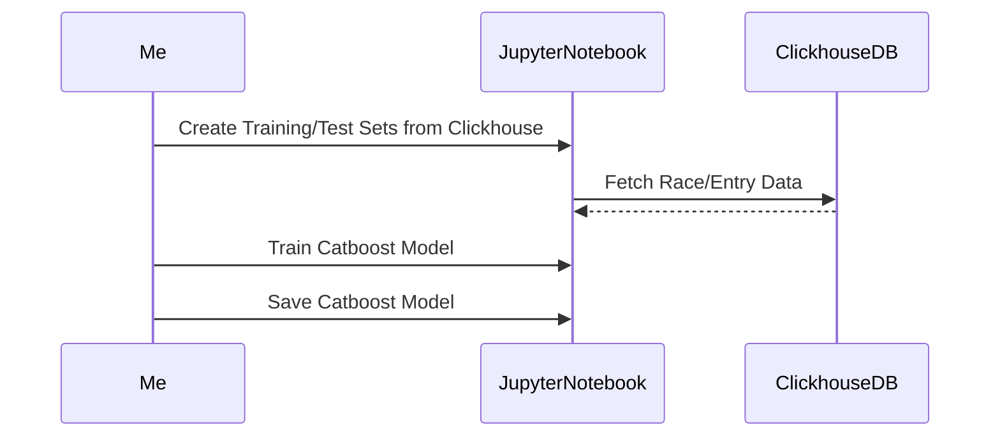
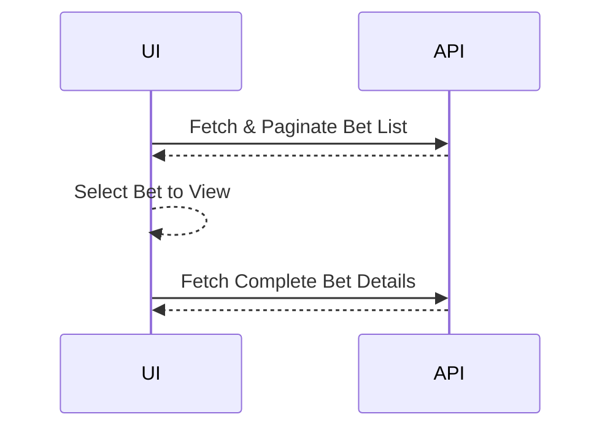

# Architecture

## Core Concepts

*Bets*

In this platform, the main output is the `Bet`, a structure that describes:
- The race date, number, and track that this bet can be placed
- The type (`BetType`) of bet, whether standard (Win, Place, Show) exotic (trifecta, exacta, tri-box, etc.)
- The cost and min/max/average return of the bet
- The `entries`, or horses in the race, and whether they are selected in the bet or not
- The strategy `BetStrategyType` that created the bet.

Bets can either bet `SingleBets`, where in the real world they would be equivalent to one betting slip, or `MultiBets`, which describe multiple betting slips across a range of races, or targetting a single race. For a `MultiBet`, there is an overarching `root` bet that aggregates the cost/return of all `sub_bets`.

*Entries/Starters*

These terms are used somewhat interchangeably in this codebase, but refer to the horses in the race that are included in a bet. An `Entry` holds all the significant data that is available from the live racing source, including:
- The horse's name, number, weight, jockey, trainer
- The horse's book odds
- The horse's predicted win probability
- The horse's last race

*Bet Tags*

These are a list of tags attached to each bet that allow for filtering of bets based on certain conditions computed at the time the bet is generated. Currently, the defined tags are:
- `Good Value` - for bets where the average return is greater than the cost of the bet
- `Free` - for bets where the minimum return is greater than the cost of the bet

## Real-time Race Processing Control Flow

## Historical Race Training Control Flow

Stage 1:

Stage 2 (as of now, this will be automated once the training method is better defined):

## API/UI Flow

